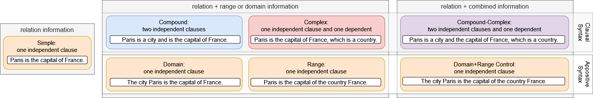
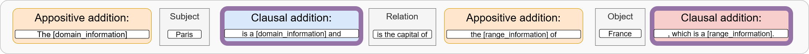

# ConPare-LAMA

## Overview
This is the official repository of the paper 'Dissecting Paraphrases: The Impact of Prompt Syntax and supplementary Information on Knowledge Retrieval from Pretrained Language Models'
Here we compare knowledge retrieval performance for prompts that follow specific syntactical features.
Per knowledge triple, we consider seven syntax variations.



In the directory 'data' you can find the datasets for the corpora 'TREx', 'GoogleRE', and 'CNET' (ConceptNet).

## Dataset Description

This repository contains data to query knowledge triples with 60 different relations.



You can instantiate for each knowledge triple seven meta-template configurations, that encode varying amounts of information while using different syntax. \n
In total, you can instantiate approx. 34 mio prompts (TREX 7 mio, GoogleRE 700k, ConceptNet 26 mio).


## Installation & Usage

You can install all the needed requirements with:

`pip install -r requirements.txt`

The performance of each of the datasets can be evaluated with the 'evaluation.py'
Change the dataset variable to 'TREx', 'GoogleRE', or 'CNET'.
When the script is finished it saves the results in a pickle file ('results_{dataset}.p')


Then you can run 'experiments.py', to get output tables for the experiments.

# Reference
```
@article{linzbach2024dissecting,
      title={Dissecting Paraphrases: The Impact of Prompt Syntax and supplementary Information on Knowledge Retrieval from Pretrained Language Models}, 
      author={Stephan Linzbach, Dimitar Dimitrov, Laura Kallmeyer, Kilian Evang, Hajira Jabeen, Stefan Dietze},
      year={2024},
      journal={Proceedings of the 2024 Conference of the North American Chapter of the Association for Computational Linguistics}
}
```

# Contact
Stephan.Linzbach@gesis.org
